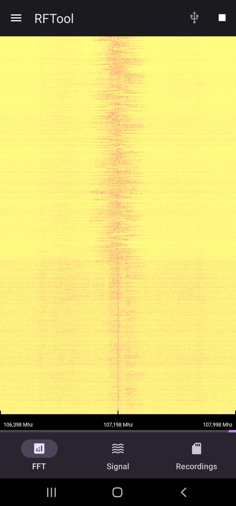
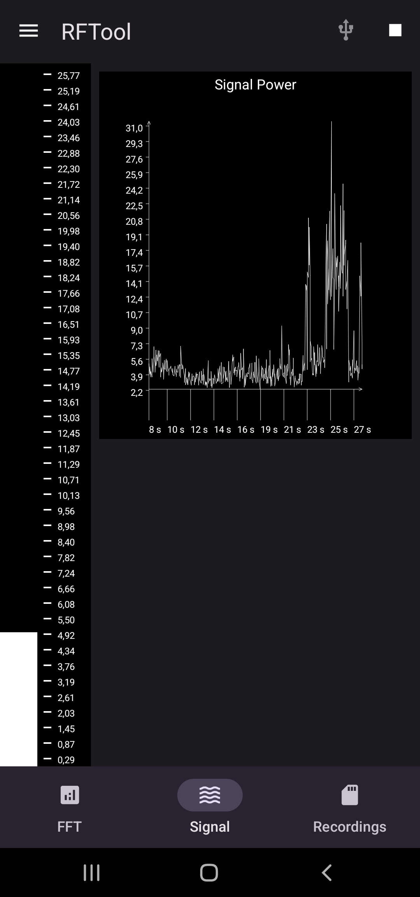
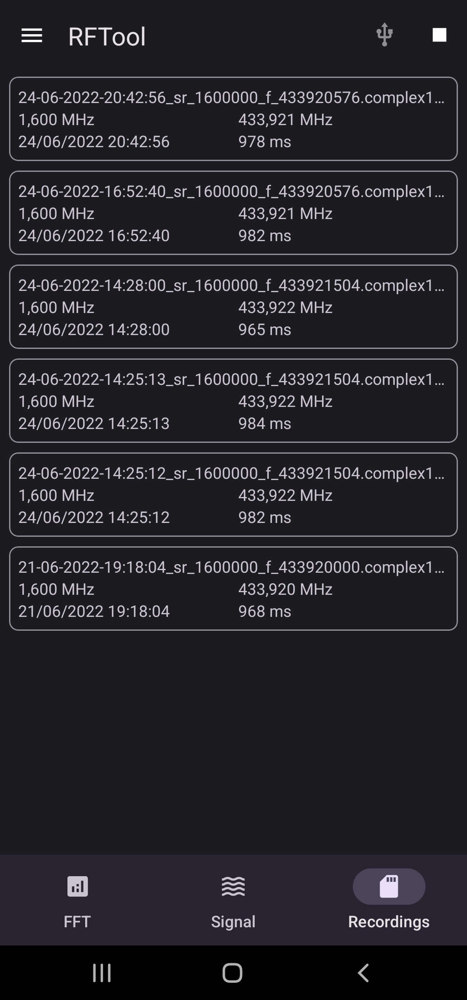

# RFTool 4 Android

An Android app for RF frequencies analysis and recording, designed to be interfaced with an USB
RTL SDR device.

## App Structure

|  |  |  |
|---------------------------------------|------------------------------------------|----------------------------------------------|

This app consists of the Kotlin/Java module which takes care of the "display" part and user interaction,
and the native library taking care of communicating with the RtlSdr USB device, doing the math (FFT),
and updating the graphics such as the spectrogram.

The native library relies on librtlsdr for the USB device setup and communication, which in turn relies
on libusb. The librtlsdr included with this project is a slightly modified version. The modifications
have been necessary to allow libusb communication inside the Android framework, with the mandatory 
permissions in place. Specifically, the modification addresses the `rtlsdr_open` method, that
originally enumerated all the RtlSdr usb devices (which is forbidden by the Android security model) 
and then selected the one at the given index.

The modified method takes an USB file descriptor where the necessary permissions have already been 
granted and the connection secured.

Additionally, the native code uses the [fftw](https://www.fftw.org/) library to perform the Fourier 
transform on the received data, sets up a specific thread for the FFT and spectrogram update. 
The FFT is also used to detect a signal above a certain threshold, so to start recording the signal
when set up in auto-record mode.

## Functions

By pressing the play button the app will connect to the RTL-SDR device, tune to the selected frequency
with the provided parameters and start reading the RF signal.

The bottom menu lets you select different views with different metrics for the current signal being received.

### The Spectrogram/FFT Screen

The FFT view will display a spectrogram of the current signal received. The spectrogram color map can be
adjusted to:

- __Grayscale__: The brightness is proportional to the signal intensity at that frequency
- __Heat__: The intensity goes from yellow to red
- __Rainbow__: Most of the color spectrum is used, from blue to red

The black band at the bottom of the spectrogram, where the frequencies are displayed, can be dragged around
to change the tuned frequency.

### The Signal screen

This view displays the real-time signal power through a meter bar and a time plot. The signal power is the absolute 
maximum in the FFT. The signal power is also used for signal detection by the auto-rec feature

### The Recordings screen

This view displays the recorded signals that you can view and share to other apps. The recording files are named
with the time they've been recorded, the sample rate and tuned frequency.

---

### The settings

By opening the left menu you can change the current settings for the RTL-SDR device (frequency, sample rate, gain,
offset, color map) and for the Auto-Rec feature. The settings are applied only when you press the button.

### The Auto-Rec function

The Auto-Rec function will detect a signal above the given treshold value and start recording the data in a file as
soon as it happens. The parameters for the Auto-Rec function are:

- __Threshold__: The threshold value is the signal power, as displayed in the Signal screen. Monitor the signal power
  for a while to find the noise baseline and set up the threshold value accordingly. The higher the threshold, the less
  sensible the recorder will be, while setting a low threshold could lead to recording noise or very weak signals that
  have little use.
- __Recording time__: The milliseconds to record.

## Credits

### [fftw](https://www.fftw.org/)

Library used for FFT implementation

### [librtlsdr](https://github.com/steve-m/librtlsdr)

An adapted version of this library is used for communicating with the RtlSdr device
through libusb

### [SPSC queue](https://github.com/cameron314/readerwriterqueue)

Thread safe queue used for the file recorder 

## License

This software is licensed under GNU GPLv3. Read the LICENSE file for additional info.
